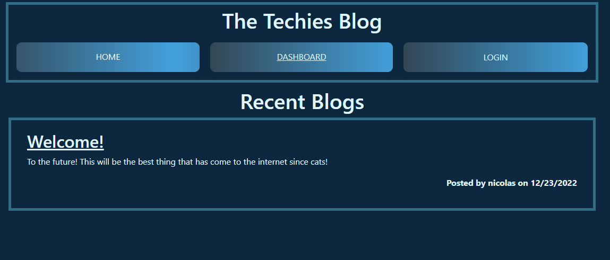

# CMS-style Blog Site

## Description

This project of mine was made for developers to share their voices about technical concepts, recent advancements, and new technologies. Other developers can read and get inspired for new technology. It is made using handlebars and includes the use of sessions, cookies and middleware. It was a great way to practice and flex these skills. 

## Installation

You can start you're own server by installing the npm dependencies with 'npm i' in you're terminal. You must have a sql server as well and run the schema file located in [here](db/schema.sql). Then just run the server file with node using 'node server.js'. To reach server just navigate to http://localhost:3001/. You can also visit a demo of the app that is hosted on Heroku located at https://the-techies-blog.herokuapp.com/.

## Usage

When first visiting the application the main page will load with a home, dashboard and login button along with recent blogs posted by users. You can click on the blog's title and it will direct you to that blog's site along with comments to that specific post. You can press the login button which will let you either login or sign up for the site. Once you do you can visit any blog post and post comments to that specific post. Once you've posted a comment you can update or delete that comment. If you navigate to the dashboard you can post new blogs as well as see existing blogs you've posted which if you click the title you can update or delete that blog. 

## License

N/A